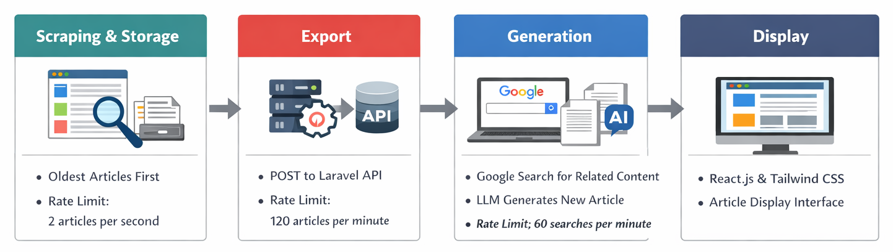

ASAW: LLM Automated Web Scraper
===============================

ASAW is an LLM-powered web scraper designed to extract articles, store them, and generate new content based on the scraped data. The project is divided into four stages:

-	[X] Scraping and Storage
-	[X] Export
-	[X] Generation
-	[ ] Display

Features
--------

-	Scrapes articles from a website
-	Stores scraped articles in a database
-	Generates new articles based on scraped data
-	Displays generated articles on a web interface

Setup
-----

### Requirements

-	Node.js (22.x)
-	PHP (8.x)
-	Composer (2.9.x)
-	Laravel (12.44.x)

### Installation

1.	Clone the repository
2.	Setup Laravel server with the following commands:

	```bash
	cd server
	composer install
	php artisan migrate
	php artisan serve
	```

	Make sure to replace DB_DATABASE, DB_USERNAME and DB_PASSWORD with as per your account and Requirements.

3.	Creeate a `.env` file in the root directory with the following content:

	```env
	BASE_URL=#website url
	API_URL=#api url (laravel server)
	SERPER_API_KEY=#serper API key (https://serper.dev)
	GEMINI_API_KEY=#gemini API key (https://ai.google.dev/gemini-api/docs)
	```

4.	Install the required packages in `automator`:

	```bash
	cd automater
	npm install

	# scrape and store locally
	npm run initdb

	# export to database
	npm run export

	# create a new article
	npm run start
	```

Workflow
--------



### Scraping and Storage

The scraper targets the oldest articles on a website first. It identifies the pagination elements to generate a complete list of URLs. The scraper then iterates through these pages in reverse order until it reaches the specified article limit or exhausts all available pages.

-	Storage: Scraped articles are stored locally for processing.
-	Rate Limit: 2 articles per second.

### Export

In this stage, locally stored articles are exported to a database via a Laravel-based API. Data is sent using POST requests; the server parses the content and stores it according to the defined database schema.

-	Rate Limit: 120 articles per minute (optimized for self-hosted server capacity).

### Generation

The system fetches the latest scraped article from the server and performs a Google search to find related content (top two articles). The original article and the top two search results (scraped) are sent to an LLM writer. The LLM then synthesizes this information to generate a new, original article. The generated article is sent to the Laravel server for storage.

-	Rate Limit: 60 search queries per minute.

### Display

The final stage involves displaying the generated articles on a web interface. This front-end component is currently in development and will be built using React.js and Tailwind CSS.

License
-------

Distributed under the [GNU General Public License v3.0.](./LICENSE)
